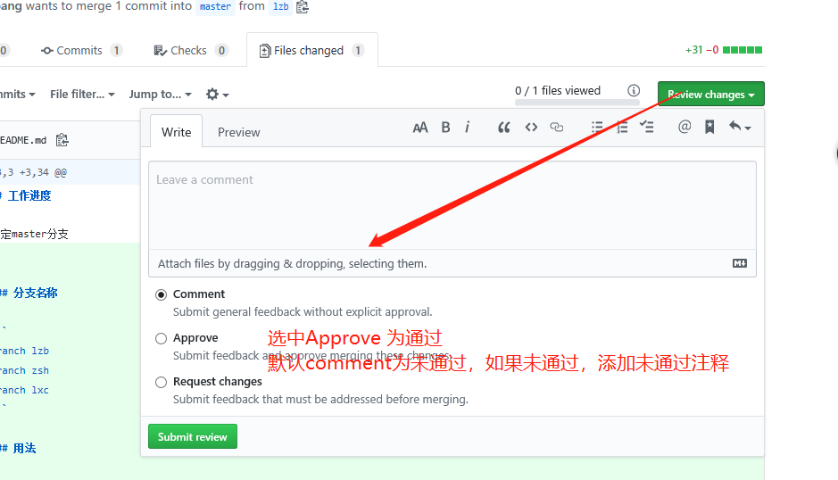

# ShopTemplate

## 工作进度

锁定master分支


### 分支名称

```
branch lzb
branch zsh
branch lxc
```

### 用法

首次，用下面的命令切换到自己的分支

```
git checkout -b lzb // 如： lzb
```

然后，使用下面的命令关联分支

```
git push --set-upstream origin lzb
```

注：第一次，用上面的命令，之后用`git push`即可


### github中合并分支


首先，在github中建立合并请求


然后，选择要合并的分支


紧接着，添加请求注释


然后，选择审核人员（目前设定至少有一位成员通过，方可合并）


再然后，审核人员审核通过



若审核通过，如下图所示：


最后，点击` Merge Pull Request`按钮即可

注：审核通过后，审核人员也可以合并代码，但不要这么做。坚持“谁请求，谁合并”的原则。