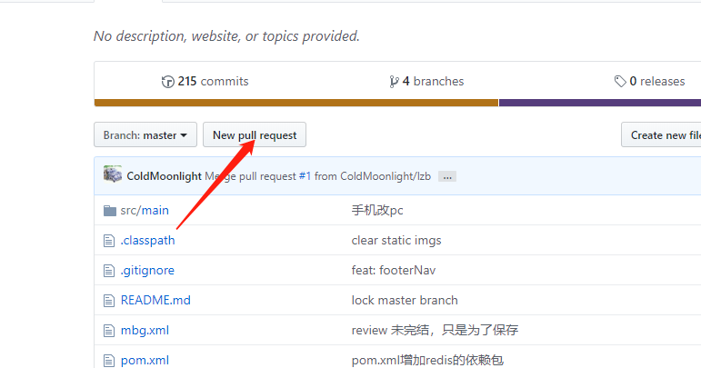
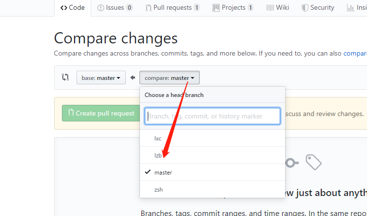
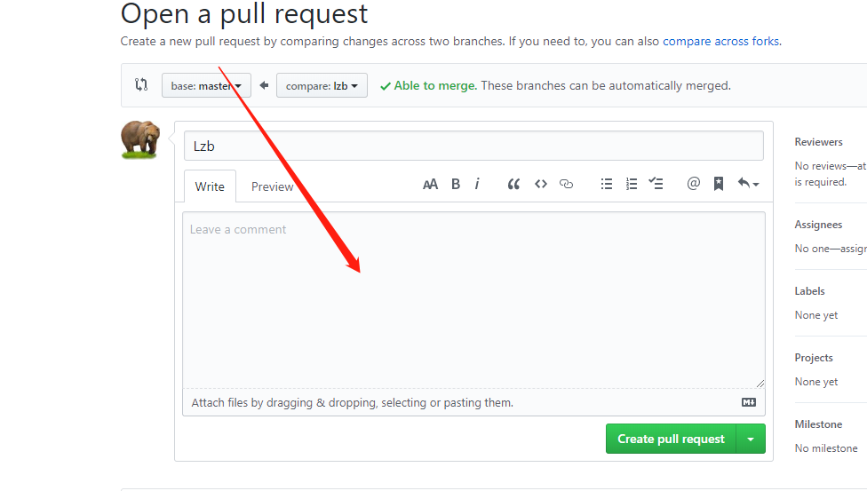
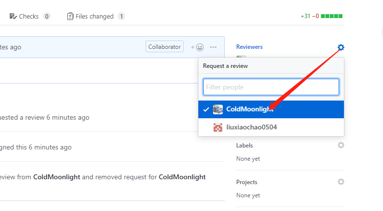
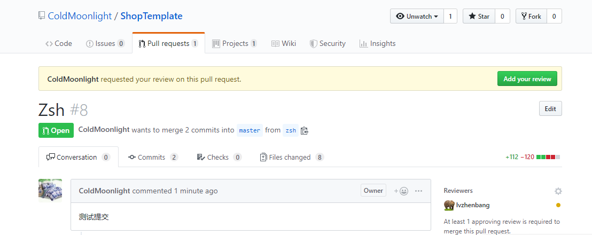
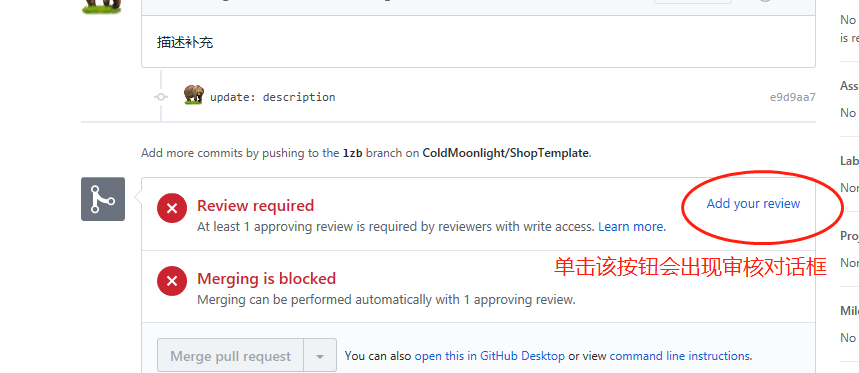
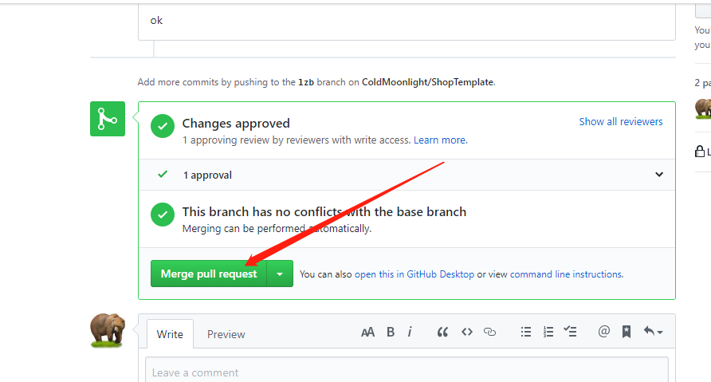
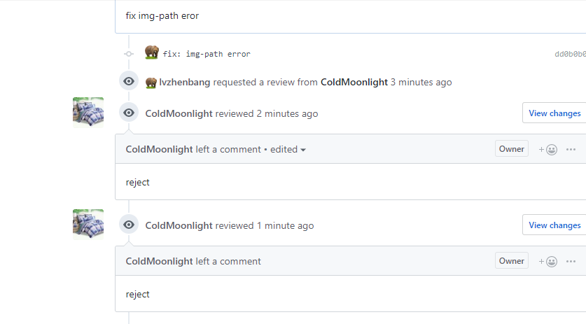

# ShopTemplate

## 同行网站

```
https://shop.luvmehair.com/
https://www.fashionnova.com
https://www.nadula.com/
https://www.klaiyihair.com/
https://www.unice.com/
```

## 网站测速工具

* [` pc `](https://developers.google.com/speed/pagespeed/insights/)
* [` mobile `](https://www.thinkwithgoogle.com/feature/testmysite)


## 工作进度

锁定master分支


### 分支名称

```
branch lzb
branch zsh
branch lxc
```

### 用法

首次，用下面的命令切换到自己的分支

```
git checkout -b lzb // 如： lzb
```

然后，使用下面的命令关联分支

```
git push --set-upstream origin lzb
```

注：第一次，用上面的命令，之后用`git push`即可


### github中合并分支


1. 在github中建立合并请求



2. 选择要合并的分支



3. 添加请求注释



4. 选择审核人员（目前设定至少有一位成员通过，方可合并）



5. 通知审核人员；审核人员找到 `Pull Request`选项并单击它，然后在请求列表中找到需要通过的请求列表项并单击它，然后按下图操作，选择是否通过审核(前提是需要查看提交记录的代码)

找到添加审核按钮（` add your review `）



 弹出审核对话框



注：两种方式均可

若审核通过，如下图所示：



审核拒绝，如下图所示：



注：被拒绝后，根据拒绝提供的注释，然后修改代码，随后编译，提交代码，然后，直接通知审核人员审核代码，不必建立二次请求。

6. 在选项卡中，找到 `Pull Request`选项并单击它，然后在请求列表中找到自己创建的请求列表项并单击它，此时会看到` Merge Pull Request`按钮处于激活状态，单击即可

注：审核通过后，审核人员也可以合并代码，但不要这么做。坚持“谁请求，谁合并”的原则。